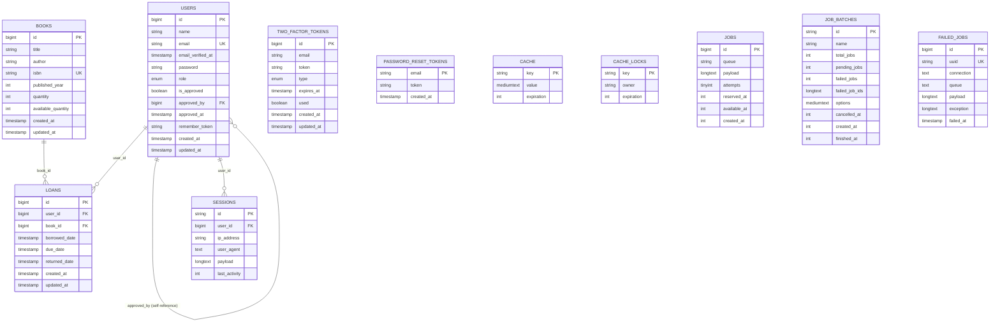

# 🗄️ DATABASE SCHEMA - SISTEM PERPUSTAKAAN DIGITAL SMK

## 📋 DAFTAR ISI
1. [Overview Database](#-overview-database)
2. [ERD (Entity Relationship Diagram)](#-erd-entity-relationship-diagram)
3. [Tabel Core System](#-tabel-core-system)
4. [Tabel System Laravel](#-tabel-system-laravel)
5. [Relasi Antar Tabel](#-relasi-antar-tabel)
6. [Index dan Constraint](#-index-dan-constraint)
7. [SQL Schema Lengkap](#-sql-schema-lengkap)
8. [Data Sample](#-data-sample)

---

## 🎯 OVERVIEW DATABASE

### **Database Information**
- **Name**: `laravel_perpustakaan` atau `laravel_1`
- **Engine**: MySQL 8.0+ / MariaDB 10.4+
- **Charset**: `utf8mb4` (Unicode support)
- **Collation**: `utf8mb4_unicode_ci`
- **Total Tables**: 9 tables
- **Core Tables**: 4 (users, books, loans, two_factor_tokens)
- **System Tables**: 5 (Laravel framework tables)

### **Database Size Estimates**
- **Small School**: ~100MB (500 users, 5000 books, 10000 loans)
- **Medium School**: ~500MB (2000 users, 20000 books, 50000 loans)
- **Large School**: ~2GB (5000 users, 50000 books, 200000 loans)

---

## 📊 ERD (Entity Relationship Diagram)



---

## 🏗️ TABEL CORE SYSTEM

### **1. 👥 USERS**
**Tabel utama untuk manajemen pengguna (siswa dan admin)**

```sql
CREATE TABLE `users` (
    `id` BIGINT UNSIGNED NOT NULL AUTO_INCREMENT,
    `name` VARCHAR(255) NOT NULL,
    `email` VARCHAR(255) NOT NULL,
    `email_verified_at` TIMESTAMP NULL,
    `password` VARCHAR(255) NOT NULL,
    `role` ENUM('admin', 'student') NOT NULL DEFAULT 'student',
    `is_approved` TINYINT(1) NOT NULL DEFAULT 1,
    `approved_by` BIGINT UNSIGNED NULL,
    `approved_at` TIMESTAMP NULL,
    `remember_token` VARCHAR(100) NULL,
    `created_at` TIMESTAMP NULL,
    `updated_at` TIMESTAMP NULL,

    PRIMARY KEY (`id`),
    UNIQUE KEY `users_email_unique` (`email`),
    KEY `users_role_is_approved_index` (`role`, `is_approved`),
    KEY `users_approved_by_foreign` (`approved_by`),

    CONSTRAINT `users_approved_by_foreign`
        FOREIGN KEY (`approved_by`)
        REFERENCES `users` (`id`)
        ON DELETE SET NULL
) ENGINE=InnoDB DEFAULT CHARSET=utf8mb4 COLLATE=utf8mb4_unicode_ci;
```

#### **Field Descriptions:**
| Field | Type | Description | Constraints |
|-------|------|-------------|-------------|
| `id` | BIGINT UNSIGNED | Primary key auto increment | NOT NULL, PK |
| `name` | VARCHAR(255) | Nama lengkap pengguna | NOT NULL |
| `email` | VARCHAR(255) | Email unik untuk login | NOT NULL, UNIQUE |
| `email_verified_at` | TIMESTAMP | Waktu verifikasi email | NULL |
| `password` | VARCHAR(255) | Password hash (bcrypt) | NOT NULL |
| `role` | ENUM | Role: 'admin' atau 'student' | DEFAULT 'student' |
| `is_approved` | TINYINT(1) | Status approval untuk admin | DEFAULT 1 |
| `approved_by` | BIGINT UNSIGNED | ID admin yang menyetujui | NULL, FK |
| `approved_at` | TIMESTAMP | Waktu approval | NULL |
| `remember_token` | VARCHAR(100) | Token "Remember Me" | NULL |

#### **Business Rules:**
- **Student**: `is_approved` = 1 (langsung aktif)
- **Admin**: `is_approved` = 0 (perlu approval), setelah disetujui = 1
- **Self-Reference**: `approved_by` merujuk ke `users.id` (admin yang menyetujui)

---

### **2. 📚 BOOKS**
**Tabel koleksi buku perpustakaan**

```sql
CREATE TABLE `books` (
    `id` BIGINT UNSIGNED NOT NULL AUTO_INCREMENT,
    `title` VARCHAR(255) NOT NULL,
    `author` VARCHAR(255) NOT NULL,
    `isbn` VARCHAR(255) NOT NULL,
    `published_year` INT NULL,
    `quantity` INT NOT NULL DEFAULT 0,
    `available_quantity` INT NOT NULL DEFAULT 0,
    `created_at` TIMESTAMP NULL,
    `updated_at` TIMESTAMP NULL,

    PRIMARY KEY (`id`),
    UNIQUE KEY `books_isbn_unique` (`isbn`),
    KEY `books_title_index` (`title`),
    KEY `books_author_index` (`author`),
    KEY `books_available_quantity_index` (`available_quantity`)
) ENGINE=InnoDB DEFAULT CHARSET=utf8mb4 COLLATE=utf8mb4_unicode_ci;
```

#### **Field Descriptions:**
| Field | Type | Description | Constraints |
|-------|------|-------------|-------------|
| `id` | BIGINT UNSIGNED | Primary key auto increment | NOT NULL, PK |
| `title` | VARCHAR(255) | Judul buku | NOT NULL |
| `author` | VARCHAR(255) | Nama penulis | NOT NULL |
| `isbn` | VARCHAR(255) | ISBN unik buku | NOT NULL, UNIQUE |
| `published_year` | INT | Tahun terbit | NULL |
| `quantity` | INT | Total eksemplar | DEFAULT 0 |
| `available_quantity` | INT | Eksemplar tersedia | DEFAULT 0 |

#### **Business Rules:**
- **Stock Logic**: `available_quantity` ≤ `quantity`
- **Borrow Check**: Hanya buku dengan `available_quantity` > 0 yang bisa dipinjam
- **Return Logic**: `available_quantity` +1 saat buku dikembalikan

---

### **3. 📋 LOANS**
**Tabel transaksi peminjaman buku**

```sql
CREATE TABLE `loans` (
    `id` BIGINT UNSIGNED NOT NULL AUTO_INCREMENT,
    `user_id` BIGINT UNSIGNED NOT NULL,
    `book_id` BIGINT UNSIGNED NOT NULL,
    `borrowed_date` TIMESTAMP NOT NULL DEFAULT CURRENT_TIMESTAMP,
    `due_date` TIMESTAMP NOT NULL,
    `returned_date` TIMESTAMP NULL,
    `created_at` TIMESTAMP NULL,
    `updated_at` TIMESTAMP NULL,

    PRIMARY KEY (`id`),
    KEY `loans_user_id_index` (`user_id`),
    KEY `loans_book_id_index` (`book_id`),
    KEY `loans_due_date_index` (`due_date`),
    KEY `loans_returned_date_index` (`returned_date`),
    KEY `loans_active_index` (`user_id`, `returned_date`),

    CONSTRAINT `loans_user_id_foreign`
        FOREIGN KEY (`user_id`)
        REFERENCES `users` (`id`)
        ON DELETE CASCADE,

    CONSTRAINT `loans_book_id_foreign`
        FOREIGN KEY (`book_id`)
        REFERENCES `books` (`id`)
        ON DELETE CASCADE
) ENGINE=InnoDB DEFAULT CHARSET=utf8mb4 COLLATE=utf8mb4_unicode_ci;
```

#### **Field Descriptions:**
| Field | Type | Description | Constraints |
|-------|------|-------------|-------------|
| `id` | BIGINT UNSIGNED | Primary key auto increment | NOT NULL, PK |
| `user_id` | BIGINT UNSIGNED | ID user peminjam | NOT NULL, FK |
| `book_id` | BIGINT UNSIGNED | ID buku yang dipinjam | NOT NULL, FK |
| `borrowed_date` | TIMESTAMP | Tanggal peminjaman | DEFAULT CURRENT_TIMESTAMP |
| `due_date` | TIMESTAMP | Tanggal jatuh tempo | NOT NULL |
| `returned_date` | TIMESTAMP | Tanggal pengembalian | NULL |

#### **Business Rules:**
- **Active Loan**: `returned_date` IS NULL
- **Returned Loan**: `returned_date` IS NOT NULL
- **Overdue**: `due_date` < NOW() AND `returned_date` IS NULL
- **Max Loans**: User maksimal 5 peminjaman aktif

---

### **4. 🔐 TWO_FACTOR_TOKENS**
**Tabel token 2FA untuk verifikasi email**

```sql
CREATE TABLE `two_factor_tokens` (
    `id` BIGINT UNSIGNED NOT NULL AUTO_INCREMENT,
    `email` VARCHAR(255) NOT NULL,
    `token` VARCHAR(6) NOT NULL,
    `type` ENUM('login', 'register') NOT NULL,
    `expires_at` TIMESTAMP NOT NULL,
    `used` TINYINT(1) NOT NULL DEFAULT 0,
    `created_at` TIMESTAMP NULL,
    `updated_at` TIMESTAMP NULL,

    PRIMARY KEY (`id`),
    KEY `two_factor_tokens_email_token_type_index` (`email`, `token`, `type`),
    KEY `two_factor_tokens_expires_at_index` (`expires_at`),
    KEY `two_factor_tokens_cleanup_index` (`expires_at`, `used`)
) ENGINE=InnoDB DEFAULT CHARSET=utf8mb4 COLLATE=utf8mb4_unicode_ci;
```

#### **Field Descriptions:**
| Field | Type | Description | Constraints |
|-------|------|-------------|-------------|
| `id` | BIGINT UNSIGNED | Primary key auto increment | NOT NULL, PK |
| `email` | VARCHAR(255) | Email tujuan token | NOT NULL |
| `token` | VARCHAR(6) | Kode 6 digit | NOT NULL |
| `type` | ENUM | Jenis: 'login' atau 'register' | NOT NULL |
| `expires_at` | TIMESTAMP | Waktu kadaluarsa (10 menit) | NOT NULL |
| `used` | TINYINT(1) | Status penggunaan | DEFAULT 0 |

#### **Business Rules:**
- **Token Validity**: 10 menit dari `created_at`
- **One-Time Use**: Setelah digunakan, `used` = 1
- **Auto Cleanup**: Token expired otomatis dihapus
- **Unique per Session**: Satu email hanya satu token aktif per type

---

## ⚙️ TABEL SYSTEM LARAVEL

### **5. 🔑 PASSWORD_RESET_TOKENS**
**Tabel untuk reset password via email**

```sql
CREATE TABLE `password_reset_tokens` (
    `email` VARCHAR(255) NOT NULL,
    `token` VARCHAR(255) NOT NULL,
    `created_at` TIMESTAMP NULL,

    PRIMARY KEY (`email`)
) ENGINE=InnoDB DEFAULT CHARSET=utf8mb4 COLLATE=utf8mb4_unicode_ci;
```

### **6. 🔗 SESSIONS**
**Tabel untuk session management Laravel**

```sql
CREATE TABLE `sessions` (
    `id` VARCHAR(255) NOT NULL,
    `user_id` BIGINT UNSIGNED NULL,
    `ip_address` VARCHAR(45) NULL,
    `user_agent` TEXT NULL,
    `payload` LONGTEXT NOT NULL,
    `last_activity` INT NOT NULL,

    PRIMARY KEY (`id`),
    KEY `sessions_user_id_index` (`user_id`),
    KEY `sessions_last_activity_index` (`last_activity`)
) ENGINE=InnoDB DEFAULT CHARSET=utf8mb4 COLLATE=utf8mb4_unicode_ci;
```

### **7. 💾 CACHE & CACHE_LOCKS**
**Tabel untuk system caching Laravel**

```sql
CREATE TABLE `cache` (
    `key` VARCHAR(255) NOT NULL,
    `value` MEDIUMTEXT NOT NULL,
    `expiration` INT NOT NULL,

    PRIMARY KEY (`key`)
) ENGINE=InnoDB DEFAULT CHARSET=utf8mb4 COLLATE=utf8mb4_unicode_ci;

CREATE TABLE `cache_locks` (
    `key` VARCHAR(255) NOT NULL,
    `owner` VARCHAR(255) NOT NULL,
    `expiration` INT NOT NULL,

    PRIMARY KEY (`key`)
) ENGINE=InnoDB DEFAULT CHARSET=utf8mb4 COLLATE=utf8mb4_unicode_ci;
```

### **8. 🔄 JOBS, JOB_BATCHES, FAILED_JOBS**
**Tabel untuk queue system Laravel**

```sql
CREATE TABLE `jobs` (
    `id` BIGINT UNSIGNED NOT NULL AUTO_INCREMENT,
    `queue` VARCHAR(255) NOT NULL,
    `payload` LONGTEXT NOT NULL,
    `attempts` TINYINT UNSIGNED NOT NULL,
    `reserved_at` INT UNSIGNED NULL,
    `available_at` INT UNSIGNED NOT NULL,
    `created_at` INT UNSIGNED NOT NULL,

    PRIMARY KEY (`id`),
    KEY `jobs_queue_index` (`queue`)
) ENGINE=InnoDB DEFAULT CHARSET=utf8mb4 COLLATE=utf8mb4_unicode_ci;

CREATE TABLE `job_batches` (
    `id` VARCHAR(255) NOT NULL,
    `name` VARCHAR(255) NOT NULL,
    `total_jobs` INT NOT NULL,
    `pending_jobs` INT NOT NULL,
    `failed_jobs` INT NOT NULL,
    `failed_job_ids` LONGTEXT NOT NULL,
    `options` MEDIUMTEXT NULL,
    `cancelled_at` INT NULL,
    `created_at` INT NOT NULL,
    `finished_at` INT NULL,

    PRIMARY KEY (`id`)
) ENGINE=InnoDB DEFAULT CHARSET=utf8mb4 COLLATE=utf8mb4_unicode_ci;

CREATE TABLE `failed_jobs` (
    `id` BIGINT UNSIGNED NOT NULL AUTO_INCREMENT,
    `uuid` VARCHAR(255) NOT NULL,
    `connection` TEXT NOT NULL,
    `queue` TEXT NOT NULL,
    `payload` LONGTEXT NOT NULL,
    `exception` LONGTEXT NOT NULL,
    `failed_at` TIMESTAMP NOT NULL DEFAULT CURRENT_TIMESTAMP,

    PRIMARY KEY (`id`),
    UNIQUE KEY `failed_jobs_uuid_unique` (`uuid`)
) ENGINE=InnoDB DEFAULT CHARSET=utf8mb4 COLLATE=utf8mb4_unicode_ci;
```

---

## 🔗 RELASI ANTAR TABEL

### **Primary Relationships**

#### **1. Users → Loans (One-to-Many)**
```sql
-- Satu user bisa memiliki banyak loans
users.id → loans.user_id
```
**Business Logic:**
- Student bisa pinjam maksimal 5 buku bersamaan
- Admin bisa pinjam tanpa batas (untuk testing/maintenance)

#### **2. Books → Loans (One-to-Many)**
```sql
-- Satu buku bisa dipinjam berkali-kali (historical records)
books.id → loans.book_id
```
**Business Logic:**
- Satu buku bisa ada multiple copies (`quantity`)
- Track availability real-time (`available_quantity`)

#### **3. Users → Users (Self-Reference)**
```sql
-- Admin yang menyetujui admin baru
users.id → users.approved_by
```
**Business Logic:**
- Admin existing approve admin baru
- Student tidak perlu approval

#### **4. Users → Sessions (One-to-Many)**
```sql
-- Track user sessions untuk security
users.id → sessions.user_id
```
**Business Logic:**
- Multi-device login support
- Session cleanup otomatis

### **Query Examples**

#### **Get Active Loans dengan User dan Book Info:**
```sql
SELECT
    l.id as loan_id,
    u.name as user_name,
    u.email,
    b.title as book_title,
    b.author,
    l.borrowed_date,
    l.due_date,
    DATEDIFF(l.due_date, NOW()) as days_remaining
FROM loans l
INNER JOIN users u ON l.user_id = u.id
INNER JOIN books b ON l.book_id = b.id
WHERE l.returned_date IS NULL
ORDER BY l.due_date ASC;
```

#### **Get Overdue Loans:**
```sql
SELECT
    l.id,
    u.name,
    u.email,
    b.title,
    l.due_date,
    DATEDIFF(NOW(), l.due_date) as days_overdue
FROM loans l
INNER JOIN users u ON l.user_id = u.id
INNER JOIN books b ON l.book_id = b.id
WHERE l.returned_date IS NULL
  AND l.due_date < NOW()
ORDER BY l.due_date ASC;
```

#### **Get Popular Books:**
```sql
SELECT
    b.id,
    b.title,
    b.author,
    COUNT(l.id) as borrow_count,
    b.available_quantity
FROM books b
LEFT JOIN loans l ON b.id = l.book_id
WHERE l.created_at >= DATE_SUB(NOW(), INTERVAL 30 DAY)
GROUP BY b.id
ORDER BY borrow_count DESC
LIMIT 10;
```

---

## 📇 INDEX DAN CONSTRAINT

### **Primary Keys**
```sql
-- Auto-increment primary keys
users.id
books.id
loans.id
two_factor_tokens.id
failed_jobs.id

-- String primary keys
password_reset_tokens.email
sessions.id
cache.key
cache_locks.key
job_batches.id
```

### **Unique Constraints**
```sql
-- Business uniqueness
users.email          -- Satu email per user
books.isbn           -- Satu ISBN per buku
failed_jobs.uuid     -- Unique job identifier
```

### **Foreign Key Constraints**
```sql
-- Referential integrity
loans.user_id → users.id (CASCADE DELETE)
loans.book_id → books.id (CASCADE DELETE)
users.approved_by → users.id (SET NULL)
```

### **Performance Indexes**
```sql
-- Composite indexes for common queries
users (role, is_approved)                    -- Admin approval queries
loans (user_id, returned_date)               -- Active loans per user
two_factor_tokens (email, token, type)       -- 2FA verification
two_factor_tokens (expires_at, used)         -- Cleanup expired tokens

-- Single column indexes
books.title                                  -- Search by title
books.author                                 -- Search by author
books.available_quantity                     -- Available books
loans.due_date                              -- Overdue checking
sessions.user_id                            -- User sessions
sessions.last_activity                      -- Session cleanup
```

---

## 💻 SQL SCHEMA LENGKAP

### **Complete Database Creation Script**

```sql
-- =====================================================
-- SISTEM PERPUSTAKAAN DIGITAL SMK - DATABASE SCHEMA
-- =====================================================

-- Create Database
CREATE DATABASE IF NOT EXISTS `laravel_perpustakaan`
CHARACTER SET utf8mb4 COLLATE utf8mb4_unicode_ci;

USE `laravel_perpustakaan`;

-- =====================================================
-- 1. USERS TABLE
-- =====================================================
CREATE TABLE `users` (
    `id` BIGINT UNSIGNED NOT NULL AUTO_INCREMENT,
    `name` VARCHAR(255) NOT NULL,
    `email` VARCHAR(255) NOT NULL,
    `email_verified_at` TIMESTAMP NULL,
    `password` VARCHAR(255) NOT NULL,
    `role` ENUM('admin', 'student') NOT NULL DEFAULT 'student',
    `is_approved` TINYINT(1) NOT NULL DEFAULT 1,
    `approved_by` BIGINT UNSIGNED NULL,
    `approved_at` TIMESTAMP NULL,
    `remember_token` VARCHAR(100) NULL,
    `created_at` TIMESTAMP NULL,
    `updated_at` TIMESTAMP NULL,

    PRIMARY KEY (`id`),
    UNIQUE KEY `users_email_unique` (`email`),
    KEY `users_role_is_approved_index` (`role`, `is_approved`),
    KEY `users_approved_by_foreign` (`approved_by`),

    CONSTRAINT `users_approved_by_foreign`
        FOREIGN KEY (`approved_by`)
        REFERENCES `users` (`id`)
        ON DELETE SET NULL
) ENGINE=InnoDB DEFAULT CHARSET=utf8mb4 COLLATE=utf8mb4_unicode_ci;

-- =====================================================
-- 2. BOOKS TABLE
-- =====================================================
CREATE TABLE `books` (
    `id` BIGINT UNSIGNED NOT NULL AUTO_INCREMENT,
    `title` VARCHAR(255) NOT NULL,
    `author` VARCHAR(255) NOT NULL,
    `isbn` VARCHAR(255) NOT NULL,
    `published_year` INT NULL,
    `quantity` INT NOT NULL DEFAULT 0,
    `available_quantity` INT NOT NULL DEFAULT 0,
    `created_at` TIMESTAMP NULL,
    `updated_at` TIMESTAMP NULL,

    PRIMARY KEY (`id`),
    UNIQUE KEY `books_isbn_unique` (`isbn`),
    KEY `books_title_index` (`title`),
    KEY `books_author_index` (`author`),
    KEY `books_available_quantity_index` (`available_quantity`)
) ENGINE=InnoDB DEFAULT CHARSET=utf8mb4 COLLATE=utf8mb4_unicode_ci;

-- =====================================================
-- 3. LOANS TABLE
-- =====================================================
CREATE TABLE `loans` (
    `id` BIGINT UNSIGNED NOT NULL AUTO_INCREMENT,
    `user_id` BIGINT UNSIGNED NOT NULL,
    `book_id` BIGINT UNSIGNED NOT NULL,
    `borrowed_date` TIMESTAMP NOT NULL DEFAULT CURRENT_TIMESTAMP,
    `due_date` TIMESTAMP NOT NULL,
    `returned_date` TIMESTAMP NULL,
    `created_at` TIMESTAMP NULL,
    `updated_at` TIMESTAMP NULL,

    PRIMARY KEY (`id`),
    KEY `loans_user_id_index` (`user_id`),
    KEY `loans_book_id_index` (`book_id`),
    KEY `loans_due_date_index` (`due_date`),
    KEY `loans_returned_date_index` (`returned_date`),
    KEY `loans_active_index` (`user_id`, `returned_date`),

    CONSTRAINT `loans_user_id_foreign`
        FOREIGN KEY (`user_id`)
        REFERENCES `users` (`id`)
        ON DELETE CASCADE,

    CONSTRAINT `loans_book_id_foreign`
        FOREIGN KEY (`book_id`)
        REFERENCES `books` (`id`)
        ON DELETE CASCADE
) ENGINE=InnoDB DEFAULT CHARSET=utf8mb4 COLLATE=utf8mb4_unicode_ci;

-- =====================================================
-- 4. TWO FACTOR TOKENS TABLE
-- =====================================================
CREATE TABLE `two_factor_tokens` (
    `id` BIGINT UNSIGNED NOT NULL AUTO_INCREMENT,
    `email` VARCHAR(255) NOT NULL,
    `token` VARCHAR(6) NOT NULL,
    `type` ENUM('login', 'register') NOT NULL,
    `expires_at` TIMESTAMP NOT NULL,
    `used` TINYINT(1) NOT NULL DEFAULT 0,
    `created_at` TIMESTAMP NULL,
    `updated_at` TIMESTAMP NULL,

    PRIMARY KEY (`id`),
    KEY `two_factor_tokens_email_token_type_index` (`email`, `token`, `type`),
    KEY `two_factor_tokens_expires_at_index` (`expires_at`),
    KEY `two_factor_tokens_cleanup_index` (`expires_at`, `used`)
) ENGINE=InnoDB DEFAULT CHARSET=utf8mb4 COLLATE=utf8mb4_unicode_ci;

-- =====================================================
-- 5. LARAVEL SYSTEM TABLES
-- =====================================================

-- Password Reset Tokens
CREATE TABLE `password_reset_tokens` (
    `email` VARCHAR(255) NOT NULL,
    `token` VARCHAR(255) NOT NULL,
    `created_at` TIMESTAMP NULL,
    PRIMARY KEY (`email`)
) ENGINE=InnoDB DEFAULT CHARSET=utf8mb4 COLLATE=utf8mb4_unicode_ci;

-- Sessions
CREATE TABLE `sessions` (
    `id` VARCHAR(255) NOT NULL,
    `user_id` BIGINT UNSIGNED NULL,
    `ip_address` VARCHAR(45) NULL,
    `user_agent` TEXT NULL,
    `payload` LONGTEXT NOT NULL,
    `last_activity` INT NOT NULL,
    PRIMARY KEY (`id`),
    KEY `sessions_user_id_index` (`user_id`),
    KEY `sessions_last_activity_index` (`last_activity`)
) ENGINE=InnoDB DEFAULT CHARSET=utf8mb4 COLLATE=utf8mb4_unicode_ci;

-- Cache Tables
CREATE TABLE `cache` (
    `key` VARCHAR(255) NOT NULL,
    `value` MEDIUMTEXT NOT NULL,
    `expiration` INT NOT NULL,
    PRIMARY KEY (`key`)
) ENGINE=InnoDB DEFAULT CHARSET=utf8mb4 COLLATE=utf8mb4_unicode_ci;

CREATE TABLE `cache_locks` (
    `key` VARCHAR(255) NOT NULL,
    `owner` VARCHAR(255) NOT NULL,
    `expiration` INT NOT NULL,
    PRIMARY KEY (`key`)
) ENGINE=InnoDB DEFAULT CHARSET=utf8mb4 COLLATE=utf8mb4_unicode_ci;

-- Queue Tables
CREATE TABLE `jobs` (
    `id` BIGINT UNSIGNED NOT NULL AUTO_INCREMENT,
    `queue` VARCHAR(255) NOT NULL,
    `payload` LONGTEXT NOT NULL,
    `attempts` TINYINT UNSIGNED NOT NULL,
    `reserved_at` INT UNSIGNED NULL,
    `available_at` INT UNSIGNED NOT NULL,
    `created_at` INT UNSIGNED NOT NULL,
    PRIMARY KEY (`id`),
    KEY `jobs_queue_index` (`queue`)
) ENGINE=InnoDB DEFAULT CHARSET=utf8mb4 COLLATE=utf8mb4_unicode_ci;

CREATE TABLE `job_batches` (
    `id` VARCHAR(255) NOT NULL,
    `name` VARCHAR(255) NOT NULL,
    `total_jobs` INT NOT NULL,
    `pending_jobs` INT NOT NULL,
    `failed_jobs` INT NOT NULL,
    `failed_job_ids` LONGTEXT NOT NULL,
    `options` MEDIUMTEXT NULL,
    `cancelled_at` INT NULL,
    `created_at` INT NOT NULL,
    `finished_at` INT NULL,
    PRIMARY KEY (`id`)
) ENGINE=InnoDB DEFAULT CHARSET=utf8mb4 COLLATE=utf8mb4_unicode_ci;

CREATE TABLE `failed_jobs` (
    `id` BIGINT UNSIGNED NOT NULL AUTO_INCREMENT,
    `uuid` VARCHAR(255) NOT NULL,
    `connection` TEXT NOT NULL,
    `queue` TEXT NOT NULL,
    `payload` LONGTEXT NOT NULL,
    `exception` LONGTEXT NOT NULL,
    `failed_at` TIMESTAMP NOT NULL DEFAULT CURRENT_TIMESTAMP,
    PRIMARY KEY (`id`),
    UNIQUE KEY `failed_jobs_uuid_unique` (`uuid`)
) ENGINE=InnoDB DEFAULT CHARSET=utf8mb4 COLLATE=utf8mb4_unicode_ci;
```

---

## 📊 DATA SAMPLE

### **Sample Users Data**

```sql
-- Insert Sample Users
INSERT INTO `users` (`id`, `name`, `email`, `email_verified_at`, `password`, `role`, `is_approved`, `approved_by`, `approved_at`, `created_at`, `updated_at`) VALUES
(1, 'Super Admin', 'admin@smk.sch.id', NOW(), '$2y$12$LQv3c1yqBwlfXo5TLtcHye8v2TkYF.0qzDo6iOCQfhz7aAXrxgqC6', 'admin', 1, NULL, NOW(), NOW(), NOW()),
(2, 'Ahmad Rizki', 'ahmad.rizki@student.smk.id', NOW(), '$2y$12$LQv3c1yqBwlfXo5TLtcHye8v2TkYF.0qzDo6iOCQfhz7aAXrxgqC6', 'student', 1, NULL, NULL, NOW(), NOW()),
(3, 'Siti Nurhaliza', 'siti.nurhaliza@student.smk.id', NOW(), '$2y$12$LQv3c1yqBwlfXo5TLtcHye8v2TkYF.0qzDo6iOCQfhz7aAXrxgqC6', 'student', 1, NULL, NULL, NOW(), NOW()),
(4, 'Budi Santoso', 'budi.admin@smk.sch.id', NOW(), '$2y$12$LQv3c1yqBwlfXo5TLtcHye8v2TkYF.0qzDo6iOCQfhz7aAXrxgqC6', 'admin', 1, 1, NOW(), NOW(), NOW()),
(5, 'Pending Admin', 'pending@smk.sch.id', NOW(), '$2y$12$LQv3c1yqBwlfXo5TLtcHye8v2TkYF.0qzDo6iOCQfhz7aAXrxgqC6', 'admin', 0, NULL, NULL, NOW(), NOW());
```

### **Sample Books Data**

```sql
-- Insert Sample Books
INSERT INTO `books` (`id`, `title`, `author`, `isbn`, `published_year`, `quantity`, `available_quantity`, `created_at`, `updated_at`) VALUES
(1, 'Pemrograman Web dengan Laravel 11', 'Andi Prasetyo', '978-623-001-001-1', 2024, 5, 3, NOW(), NOW()),
(2, 'Database MySQL untuk Pemula', 'Sari Indah', '978-623-001-002-8', 2023, 3, 2, NOW(), NOW()),
(3, 'Algoritma dan Struktur Data', 'Budi Raharjo', '978-623-001-003-5', 2023, 4, 4, NOW(), NOW()),
(4, 'Jaringan Komputer Dasar', 'Eko Nugroho', '978-623-001-004-2', 2022, 2, 1, NOW(), NOW()),
(5, 'HTML CSS JavaScript Modern', 'Rini Sartika', '978-623-001-005-9', 2024, 6, 5, NOW(), NOW());
```

### **Sample Loans Data**

```sql
-- Insert Sample Loans (Active)
INSERT INTO `loans` (`id`, `user_id`, `book_id`, `borrowed_date`, `due_date`, `returned_date`, `created_at`, `updated_at`) VALUES
(1, 2, 1, '2025-09-15 10:30:00', '2025-09-29 23:59:59', NULL, NOW(), NOW()),
(2, 3, 2, '2025-09-18 14:20:00', '2025-10-02 23:59:59', NULL, NOW(), NOW()),
(3, 2, 4, '2025-09-20 09:15:00', '2025-10-04 23:59:59', NULL, NOW(), NOW());

-- Insert Sample Loans (Returned)
INSERT INTO `loans` (`id`, `user_id`, `book_id`, `borrowed_date`, `due_date`, `returned_date`, `created_at`, `updated_at`) VALUES
(4, 3, 1, '2025-09-01 11:00:00', '2025-09-15 23:59:59', '2025-09-14 16:30:00', '2025-09-01 11:00:00', '2025-09-14 16:30:00'),
(5, 2, 3, '2025-09-05 13:45:00', '2025-09-19 23:59:59', '2025-09-18 10:20:00', '2025-09-05 13:45:00', '2025-09-18 10:20:00');
```

---

## 🔍 VALIDATION QUERIES

### **Check Database Integrity**

```sql
-- 1. Verify User Role Distribution
SELECT role, is_approved, COUNT(*) as count
FROM users
GROUP BY role, is_approved;

-- 2. Check Book Availability Logic
SELECT
    id, title, quantity, available_quantity,
    (quantity - available_quantity) as borrowed_count
FROM books
WHERE available_quantity > quantity; -- Should return 0 rows

-- 3. Verify Active Loans Count
SELECT
    u.name,
    COUNT(l.id) as active_loans
FROM users u
LEFT JOIN loans l ON u.id = l.user_id AND l.returned_date IS NULL
WHERE u.role = 'student'
GROUP BY u.id, u.name
HAVING active_loans > 5; -- Should return 0 rows (max 5 loans)

-- 4. Check for Orphaned Records
SELECT 'loans without user' as issue, COUNT(*) as count
FROM loans l
LEFT JOIN users u ON l.user_id = u.id
WHERE u.id IS NULL

UNION ALL

SELECT 'loans without book' as issue, COUNT(*) as count
FROM loans l
LEFT JOIN books b ON l.book_id = b.id
WHERE b.id IS NULL;

-- 5. Verify 2FA Token Cleanup
SELECT
    COUNT(*) as expired_tokens
FROM two_factor_tokens
WHERE expires_at < NOW() AND used = 0; -- Should be cleaned regularly
```

---

## 📈 PERFORMANCE OPTIMIZATION

### **Recommended Indexes untuk Production**

```sql
-- Additional performance indexes
ALTER TABLE loans ADD INDEX idx_user_active (user_id, returned_date, due_date);
ALTER TABLE loans ADD INDEX idx_book_active (book_id, returned_date);
ALTER TABLE loans ADD INDEX idx_overdue (due_date, returned_date);

-- Full-text search indexes (optional)
ALTER TABLE books ADD FULLTEXT(title, author);

-- Partitioning untuk tabel besar (optional)
-- ALTER TABLE loans PARTITION BY RANGE (YEAR(created_at)) (
--     PARTITION p2023 VALUES LESS THAN (2024),
--     PARTITION p2024 VALUES LESS THAN (2025),
--     PARTITION p2025 VALUES LESS THAN (2026),
--     PARTITION p_future VALUES LESS THAN MAXVALUE
-- );
```

### **Maintenance Scripts**

```sql
-- Clean expired 2FA tokens (run daily)
DELETE FROM two_factor_tokens
WHERE expires_at < DATE_SUB(NOW(), INTERVAL 1 DAY);

-- Clean old sessions (run weekly)
DELETE FROM sessions
WHERE last_activity < UNIX_TIMESTAMP(DATE_SUB(NOW(), INTERVAL 30 DAY));

-- Update statistics (run monthly)
ANALYZE TABLE users, books, loans, two_factor_tokens;
```

---

**📊 Schema database ini dirancang untuk mendukung sistem perpustakaan SMK dengan performa optimal, keamanan tinggi, dan scalability yang baik untuk pertumbuhan sekolah di masa depan.**