# 🔧 Schema Pemrograman - Sistem Perpustakaan Digital SMK

[](https://laravel.com)
[](https://php.net)
[](https://javascript.info)

> **Dokumentasi lengkap arsitektur pemrograman, alur sistem, dan flowchart untuk Sistem Perpustakaan Digital SMK**

---

## 📋 **Table of Contents**

1. [Arsitektur Sistem](#-arsitektur-sistem)
2. [Pattern & Struktur Kode](#-pattern--struktur-kode)
3. [Alur Autentikasi 2FA](#-alur-autentikasi-2fa)
4. [Sistem Peminjaman Buku](#-sistem-peminjaman-buku)
5. [Dashboard Analytics](#-dashboard-analytics)
6. [Email Notification System](#-email-notification-system)
7. [Admin Management](#-admin-management)
8. [Security Layer](#-security-layer)
9. [Performance Optimization](#-performance-optimization)
10. [Testing Strategy](#-testing-strategy)

---

## 🏗️ **Arsitektur Sistem**

### **MVC Pattern Implementation**

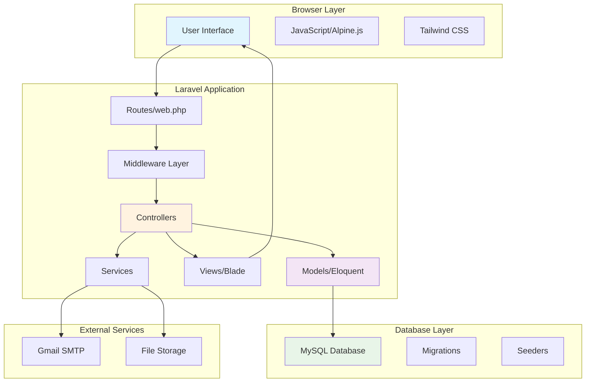

### **Directory Structure**

```
📁 projectku/
├── 📁 app/
│   ├── 📁 Http/
│   │   ├── 📁 Controllers/
│   │   │   ├── 📁 Auth/
│   │   │   │   ├── 📄 AuthenticatedSessionController.php
│   │   │   │   ├── 📄 RegisteredUserController.php
│   │   │   │   └── 📄 TwoFactorController.php
│   │   │   ├── 📁 Admin/
│   │   │   │   ├── 📄 UserApprovalController.php
│   │   │   │   └── 📄 ReportController.php
│   │   │   ├── 📄 BookController.php
│   │   │   ├── 📄 LoanController.php
│   │   │   └── 📄 DashboardController.php
│   │   └── 📁 Middleware/
│   │       └── 📄 AdminMiddleware.php
│   ├── 📁 Models/
│   │   ├── 📄 User.php
│   │   ├── 📄 Book.php
│   │   ├── 📄 Loan.php
│   │   └── 📄 TwoFactorToken.php
│   └── 📁 Mail/
│       └── 📄 BookLoanNotification.php
├── 📁 database/
│   └── 📁 migrations/
├── 📁 resources/
│   ├── 📁 views/
│   └── 📁 js/
└── 📁 routes/
    └── 📄 web.php
```

---

## 🎯 **Pattern & Struktur Kode**

### **1. Controller Pattern**

```php
// BookController.php - Resource Controller Pattern
class BookController extends Controller
{
    public function index()     // GET /books - List books
    public function create()    // GET /books/create - Show form
    public function store()     // POST /books - Save new book
    public function show($id)   // GET /books/{id} - Show book
    public function edit($id)   // GET /books/{id}/edit - Edit form
    public function update($id) // PUT /books/{id} - Update book
    public function destroy($id)// DELETE /books/{id} - Delete book
}
```

### **2. Model Relationships**

```php
// User Model - Eloquent Relationships
class User extends Model
{
    // One-to-Many: User has many loans
    public function loans()
    {
        return $this->hasMany(Loan::class);
    }

    // Many-to-Many: User can approve other users
    public function approvedUsers()
    {
        return $this->hasMany(User::class, 'approved_by');
    }
}

// Book Model
class Book extends Model
{
    // One-to-Many: Book has many loans
    public function loans()
    {
        return $this->hasMany(Loan::class);
    }

    // Accessor: Available quantity
    public function getIsAvailableAttribute()
    {
        return $this->available_quantity > 0;
    }
}

// Loan Model - Pivot Table with data
class Loan extends Model
{
    // Many-to-One: Loan belongs to User
    public function user()
    {
        return $this->belongsTo(User::class);
    }

    // Many-to-One: Loan belongs to Book
    public function book()
    {
        return $this->belongsTo(Book::class);
    }

    // Scope: Active loans
    public function scopeActive($query)
    {
        return $query->whereNull('returned_date');
    }
}
```

### **3. Middleware Pattern**

```php
// AdminMiddleware.php - Route Protection
class AdminMiddleware
{
    public function handle(Request $request, Closure $next)
    {
        if (!auth()->check()) {
            return redirect()->route('login');
        }

        if (auth()->user()->role !== 'admin') {
            abort(403, 'Unauthorized');
        }

        if (!auth()->user()->is_approved) {
            return redirect()->route('approval.pending');
        }

        return $next($request);
    }
}
```

---

## 🔐 **Alur Autentikasi 2FA**

### **Flowchart Registrasi dengan 2FA**

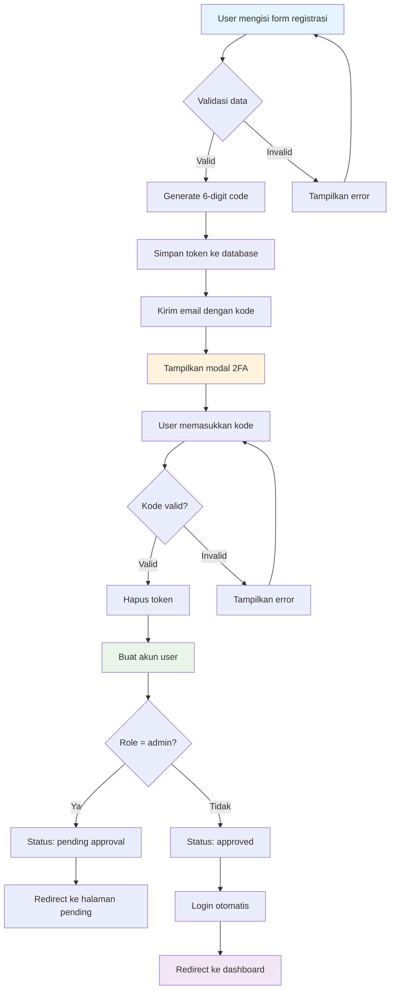

### **Implementasi 2FA Controller**

```php
// TwoFactorController.php
class TwoFactorController extends Controller
{
    public function sendCode(Request $request)
    {
        // 1. Validasi email
        $request->validate(['email' => 'required|email']);

        // 2. Generate 6-digit code
        $code = sprintf('%06d', mt_rand(1, 999999));

        // 3. Simpan token dengan expiry
        TwoFactorToken::create([
            'email' => $request->email,
            'token' => $code,
            'type' => $request->type,
            'expires_at' => now()->addMinutes(10)
        ]);

        // 4. Kirim email
        Mail::to($request->email)->send(new TwoFactorCodeMail($code));

        // 5. Return JSON response
        return response()->json(['success' => true]);
    }

    public function verifyCode(Request $request)
    {
        // 1. Cari token yang valid
        $token = TwoFactorToken::where([
            'email' => $request->email,
            'token' => $request->token,
            'type' => $request->type,
            'used' => false
        ])->where('expires_at', '>', now())->first();

        // 2. Validasi token
        if (!$token) {
            return response()->json([
                'success' => false,
                'message' => 'Kode tidak valid atau sudah kadaluarsa'
            ]);
        }

        // 3. Mark token as used
        $token->update(['used' => true]);

        return response()->json(['success' => true]);
    }
}
```

---

## 📚 **Sistem Peminjaman Buku**

### **Flowchart Peminjaman Buku**

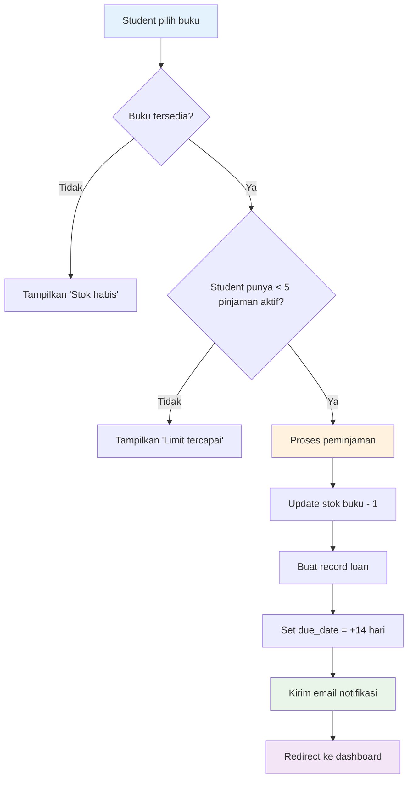

### **Loan Controller Logic**

```php
// LoanController.php
class LoanController extends Controller
{
    public function store(Request $request)
    {
        // 1. Validasi request
        $request->validate([
            'book_id' => 'required|exists:books,id'
        ]);

        $user = auth()->user();
        $book = Book::findOrFail($request->book_id);

        // 2. Business rules validation
        if ($book->available_quantity <= 0) {
            return back()->with('error', 'Buku tidak tersedia');
        }

        if ($user->role === 'student' && $user->loans()->active()->count() >= 5) {
            return back()->with('error', 'Maksimal 5 buku');
        }

        // 3. Database transaction
        DB::transaction(function () use ($user, $book) {
            // Create loan record
            $loan = Loan::create([
                'user_id' => $user->id,
                'book_id' => $book->id,
                'borrowed_date' => now(),
                'due_date' => now()->addDays(14)
            ]);

            // Update book stock
            $book->decrement('available_quantity');

            // Send notification email
            Mail::to($user->email)->send(
                new BookLoanNotification($loan)
            );
        });

        return redirect()->route('dashboard')->with('success', 'Buku berhasil dipinjam');
    }

    public function return(Loan $loan)
    {
        // 1. Validasi ownership
        if ($loan->user_id !== auth()->id() && !auth()->user()->isAdmin()) {
            abort(403);
        }

        // 2. Cek jika sudah dikembalikan
        if ($loan->returned_date) {
            return back()->with('error', 'Buku sudah dikembalikan');
        }

        // 3. Process return
        DB::transaction(function () use ($loan) {
            $loan->update(['returned_date' => now()]);
            $loan->book->increment('available_quantity');
        });

        return back()->with('success', 'Buku berhasil dikembalikan');
    }
}
```

---

## 📊 **Dashboard Analytics**

### **Data Flow Dashboard**

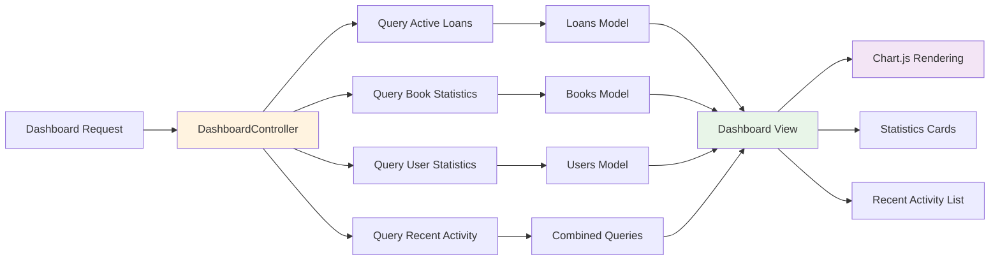

### **Dashboard Controller Implementation**

```php
// DashboardController.php
class DashboardController extends Controller
{
    public function index()
    {
        $user = auth()->user();

        if ($user->role === 'admin') {
            return $this->adminDashboard();
        }

        return $this->studentDashboard();
    }

    private function adminDashboard()
    {
        // Statistics untuk admin
        $stats = [
            'total_books' => Book::count(),
            'total_users' => User::where('role', 'student')->count(),
            'active_loans' => Loan::active()->count(),
            'overdue_loans' => Loan::active()->where('due_date', '<', now())->count(),
        ];

        // Chart data - Peminjaman per bulan
        $monthlyLoans = Loan::selectRaw('MONTH(created_at) as month, COUNT(*) as count')
            ->whereYear('created_at', now()->year)
            ->groupBy('month')
            ->pluck('count', 'month')
            ->toArray();

        // Popular books
        $popularBooks = Book::withCount('loans')
            ->orderBy('loans_count', 'desc')
            ->limit(5)
            ->get();

        // Recent activity
        $recentLoans = Loan::with(['user', 'book'])
            ->latest()
            ->limit(10)
            ->get();

        return view('dashboard', compact('stats', 'monthlyLoans', 'popularBooks', 'recentLoans'));
    }

    private function studentDashboard()
    {
        $user = auth()->user();

        // Student statistics
        $stats = [
            'active_loans' => $user->loans()->active()->count(),
            'total_loans' => $user->loans()->count(),
            'overdue_loans' => $user->loans()->active()->where('due_date', '<', now())->count(),
            'available_books' => Book::where('available_quantity', '>', 0)->count(),
        ];

        // Current loans
        $currentLoans = $user->loans()->active()->with('book')->get();

        // Loan history
        $loanHistory = $user->loans()->with('book')->latest()->limit(5)->get();

        return view('dashboard', compact('stats', 'currentLoans', 'loanHistory'));
    }
}
```

---

## 📧 **Email Notification System**

### **Email Flow Architecture**

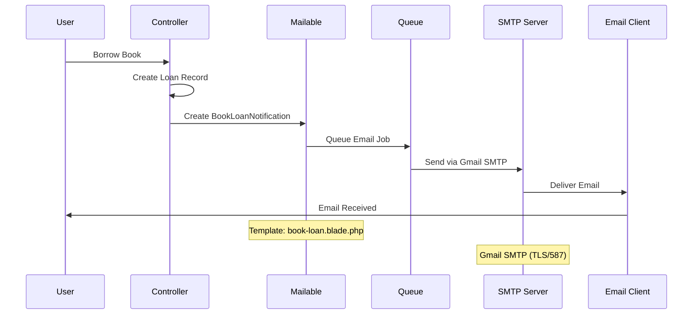

### **Mailable Class Implementation**

```php
// BookLoanNotification.php
class BookLoanNotification extends Mailable
{
    use Queueable, SerializesModels;

    public $loan;

    public function __construct(Loan $loan)
    {
        $this->loan = $loan;
    }

    public function build()
    {
        return $this->subject('Konfirmasi Peminjaman Buku - ' . $this->loan->book->title)
                    ->view('emails.book-loan')
                    ->with([
                        'user' => $this->loan->user,
                        'book' => $this->loan->book,
                        'borrowedDate' => $this->loan->borrowed_date->format('d M Y'),
                        'dueDate' => $this->loan->due_date->format('d M Y'),
                        'loanId' => $this->loan->id
                    ]);
    }
}
```

---

## 👨‍💼 **Admin Management**

### **Admin Approval Process**

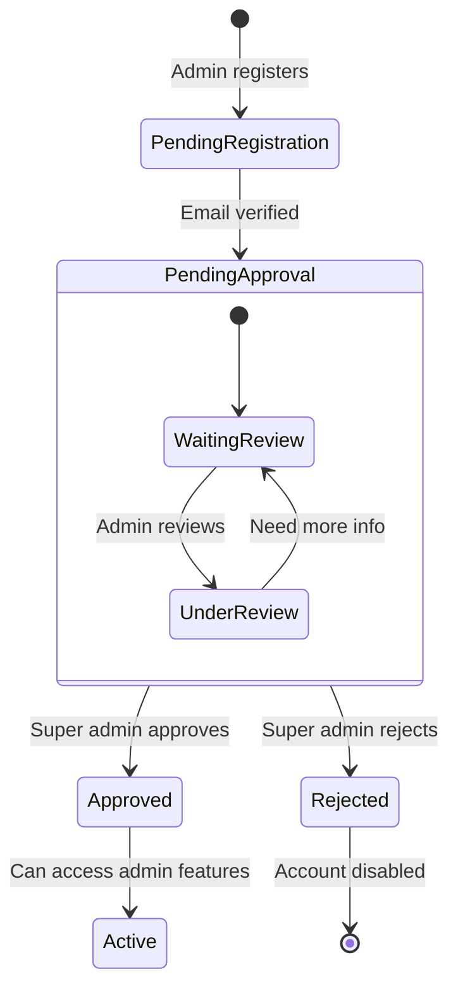

### **User Approval Controller**

```php
// UserApprovalController.php
class UserApprovalController extends Controller
{
    public function index()
    {
        // Hanya super admin yang bisa approve
        if (!auth()->user()->isAdmin() || auth()->user()->email !== 'admin@smk.sch.id') {
            abort(403);
        }

        $pendingUsers = User::where('role', 'admin')
                           ->where('is_approved', false)
                           ->latest()
                           ->get();

        return view('admin.user-approval', compact('pendingUsers'));
    }

    public function approve(User $user)
    {
        $user->update([
            'is_approved' => true,
            'approved_by' => auth()->id(),
            'approved_at' => now()
        ]);

        // Send approval email
        Mail::to($user->email)->send(new AdminApprovalNotification($user));

        return back()->with('success', 'User berhasil disetujui');
    }

    public function reject(User $user)
    {
        $user->delete();

        return back()->with('success', 'User berhasil ditolak');
    }
}
```

---

## 🛡️ **Security Layer**

### **Security Implementation Stack**

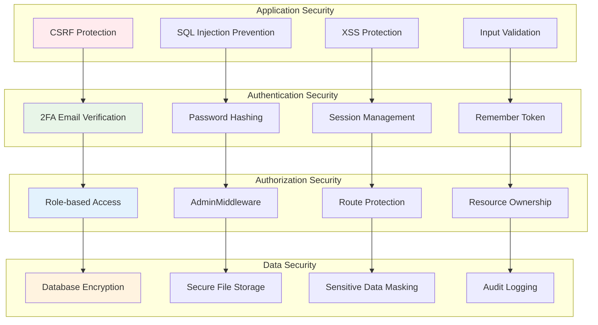

### **Middleware Security Chain**

```php
// bootstrap/app.php - Security Middleware
return Application::configure(basePath: dirname(__DIR__))
    ->withRouting(
        web: __DIR__.'/../routes/web.php',
        commands: __DIR__.'/../routes/console.php',
        health: '/up',
    )
    ->withMiddleware(function (Middleware $middleware) {
        // Global middleware stack
        $middleware->web(append: [
            \App\Http\Middleware\EncryptCookies::class,
            \Illuminate\Cookie\Middleware\AddQueuedCookiesToResponse::class,
            \Illuminate\Session\Middleware\StartSession::class,
            \Illuminate\View\Middleware\ShareErrorsFromSession::class,
            \App\Http\Middleware\VerifyCsrfToken::class,
            \Illuminate\Routing\Middleware\SubstituteBindings::class,
        ]);

        // Route-specific middleware
        $middleware->alias([
            'admin' => \App\Http\Middleware\AdminMiddleware::class,
            'auth' => \Illuminate\Auth\Middleware\Authenticate::class,
            'verified' => \Illuminate\Auth\Middleware\EnsureEmailIsVerified::class,
        ]);
    });
```

---

## ⚡ **Performance Optimization**

### **Optimization Strategy**

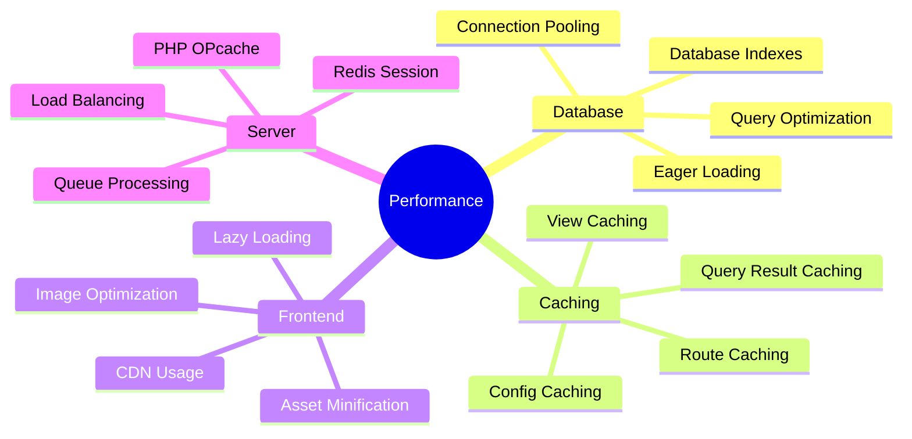

### **Database Optimization**

```php
// Optimized Queries dengan Eager Loading
class BookController extends Controller
{
    public function index()
    {
        // Eager loading untuk menghindari N+1 queries
        $books = Book::with(['loans' => function($query) {
                    $query->active()->with('user');
                }])
                ->withCount('loans')
                ->orderBy('title')
                ->paginate(20);

        return view('books.index', compact('books'));
    }
}

// Loan queries dengan proper indexing
class LoanController extends Controller
{
    public function activeLoans()
    {
        return Loan::with(['user:id,name,email', 'book:id,title,author'])
                   ->whereNull('returned_date')
                   ->orderBy('due_date')
                   ->get();
    }

    public function overdueLoans()
    {
        return Loan::with(['user:id,name,email', 'book:id,title,author'])
                   ->whereNull('returned_date')
                   ->where('due_date', '<', now())
                   ->orderBy('due_date')
                   ->get();
    }
}
```

---

## 🧪 **Testing Strategy**

### **Testing Pyramid**

```mermaid
pyramid
    title Testing Strategy

    top "E2E Tests"
    middle "Integration Tests"
    bottom "Unit Tests"
```

### **Test Cases Implementation**

```php
// BookControllerTest.php
class BookControllerTest extends TestCase
{
    use RefreshDatabase;

    public function test_admin_can_create_book()
    {
        $admin = User::factory()->admin()->create();

        $response = $this->actingAs($admin)
                         ->post('/books', [
                             'title' => 'Test Book',
                             'author' => 'Test Author',
                             'isbn' => '1234567890',
                             'quantity' => 5
                         ]);

        $response->assertRedirect('/books');
        $this->assertDatabaseHas('books', ['title' => 'Test Book']);
    }

    public function test_student_cannot_create_book()
    {
        $student = User::factory()->student()->create();

        $response = $this->actingAs($student)
                         ->post('/books', [
                             'title' => 'Test Book',
                             'author' => 'Test Author',
                             'isbn' => '1234567890'
                         ]);

        $response->assertStatus(403);
    }
}

// LoanTest.php
class LoanTest extends TestCase
{
    public function test_student_can_borrow_available_book()
    {
        $student = User::factory()->student()->create();
        $book = Book::factory()->create(['available_quantity' => 1]);

        $response = $this->actingAs($student)
                         ->post('/loans', ['book_id' => $book->id]);

        $response->assertRedirect('/dashboard');
        $this->assertDatabaseHas('loans', [
            'user_id' => $student->id,
            'book_id' => $book->id,
            'returned_date' => null
        ]);

        $book->refresh();
        $this->assertEquals(0, $book->available_quantity);
    }

    public function test_student_cannot_borrow_more_than_5_books()
    {
        $student = User::factory()->student()->create();

        // Create 5 active loans
        Loan::factory()->count(5)->active()->create(['user_id' => $student->id]);

        $book = Book::factory()->create(['available_quantity' => 1]);

        $response = $this->actingAs($student)
                         ->post('/loans', ['book_id' => $book->id]);

        $response->assertSessionHas('error', 'Maksimal 5 buku');
    }
}
```

---

## 📈 **Deployment Schema**

### **Production Deployment Flow**

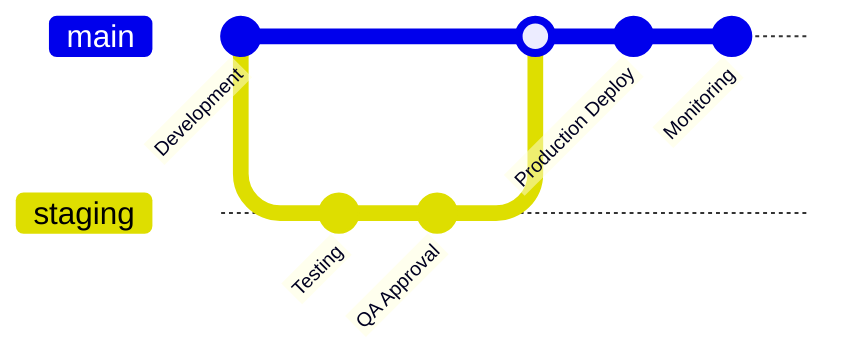

### **Environment Configuration**

```bash
# Production .env Configuration
APP_ENV=production
APP_DEBUG=false
APP_URL=https://perpustakaan.smk.sch.id

# Database Configuration
DB_CONNECTION=mysql
DB_HOST=127.0.0.1
DB_PORT=3306
DB_DATABASE=laravel_perpustakaan
DB_USERNAME=perpus_user
DB_PASSWORD=secure_password

# Mail Configuration
MAIL_MAILER=smtp
MAIL_HOST=smtp.gmail.com
MAIL_PORT=587
MAIL_USERNAME=perpustakaan@smk.sch.id
MAIL_PASSWORD=app_password
MAIL_ENCRYPTION=tls

# Cache & Session
CACHE_DRIVER=redis
SESSION_DRIVER=redis
QUEUE_CONNECTION=redis

# Redis Configuration
REDIS_HOST=127.0.0.1
REDIS_PASSWORD=null
REDIS_PORT=6379
```

---

## 🔄 **System Integration Flow**

### **Complete User Journey**

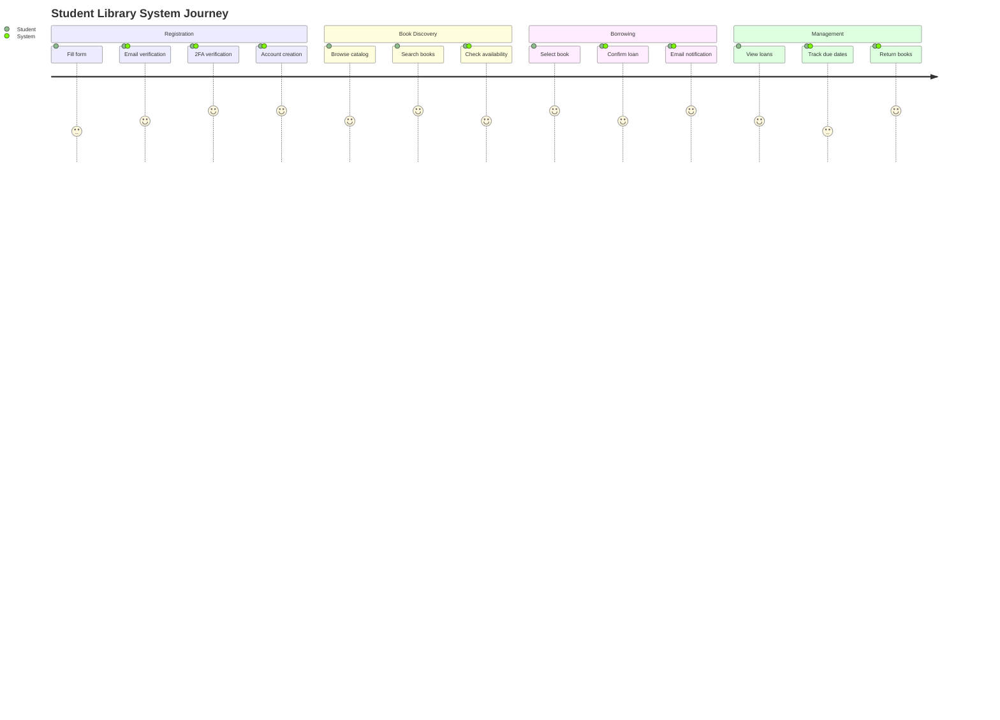

---

## 📊 **Monitoring & Analytics**

### **System Health Monitoring**

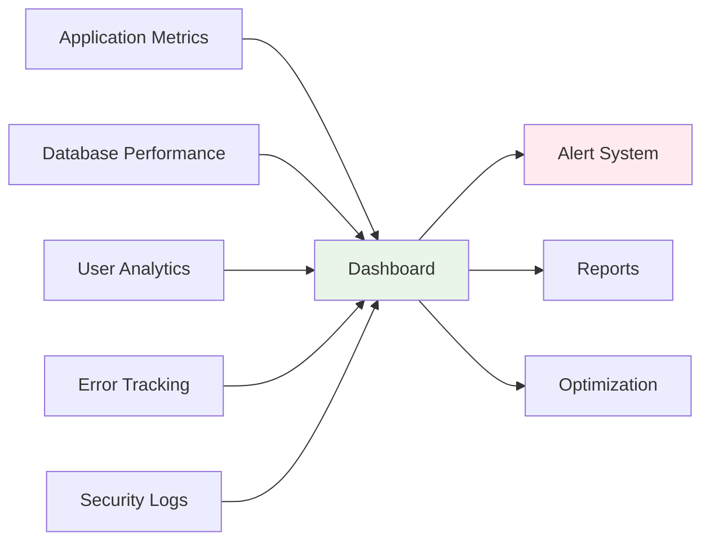

---

## 🎯 **Business Logic Summary**

### **Core Business Rules**

1. **Authentication**
   - 2FA required for all registrations
   - Admin approval required for admin accounts
   - Session timeout after 2 hours of inactivity

2. **Book Management**
   - Only admins can add/edit/delete books
   - Stock tracking in real-time
   - ISBN must be unique

3. **Loan System**
   - Students max 5 active loans
   - 14-day loan period
   - Email notifications for all transactions
   - Automatic overdue tracking

4. **Security**
   - CSRF protection on all forms
   - SQL injection prevention via Eloquent
   - XSS protection via Blade templating
   - Role-based access control

---

## 🚀 **Future Enhancements**

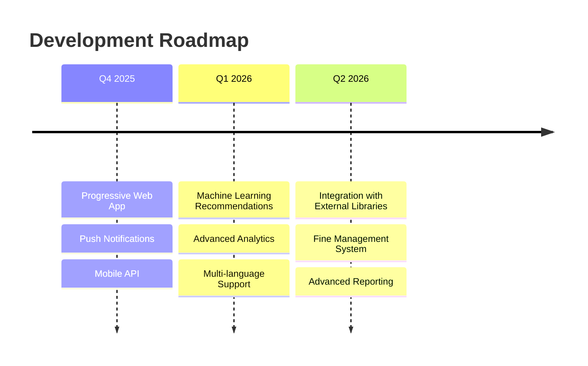

---

## 📝 **Code Standards & Conventions**

### **PHP Standards (PSR-12)**

```php
<?php

namespace App\Http\Controllers;

use App\Models\Book;
use App\Models\Loan;
use Illuminate\Http\Request;
use Illuminate\Support\Facades\DB;

class ExampleController extends Controller
{
    /**
     * Display a listing of the resource.
     */
    public function index(Request $request): View
    {
        $books = Book::query()
            ->when($request->search, function ($query, $search) {
                $query->where('title', 'like', "%{$search}%")
                      ->orWhere('author', 'like', "%{$search}%");
            })
            ->paginate(20);

        return view('books.index', compact('books'));
    }
}
```

### **JavaScript Standards (ES6+)**

```javascript
// Alpine.js Component
document.addEventListener('alpine:init', () => {
    Alpine.data('bookLoan', () => ({
        loading: false,

        async borrowBook(bookId) {
            this.loading = true;

            try {
                const response = await fetch('/loans', {
                    method: 'POST',
                    headers: {
                        'Content-Type': 'application/json',
                        'X-CSRF-TOKEN': document.querySelector('meta[name="csrf-token"]').getAttribute('content')
                    },
                    body: JSON.stringify({ book_id: bookId })
                });

                const data = await response.json();

                if (data.success) {
                    this.$dispatch('book-borrowed', { bookId });
                    window.location.reload();
                } else {
                    alert(data.message);
                }
            } catch (error) {
                console.error('Error:', error);
                alert('Terjadi kesalahan sistem');
            } finally {
                this.loading = false;
            }
        }
    }));
});
```

---

## 🔍 **Error Handling Strategy**

### **Exception Handling Flow**

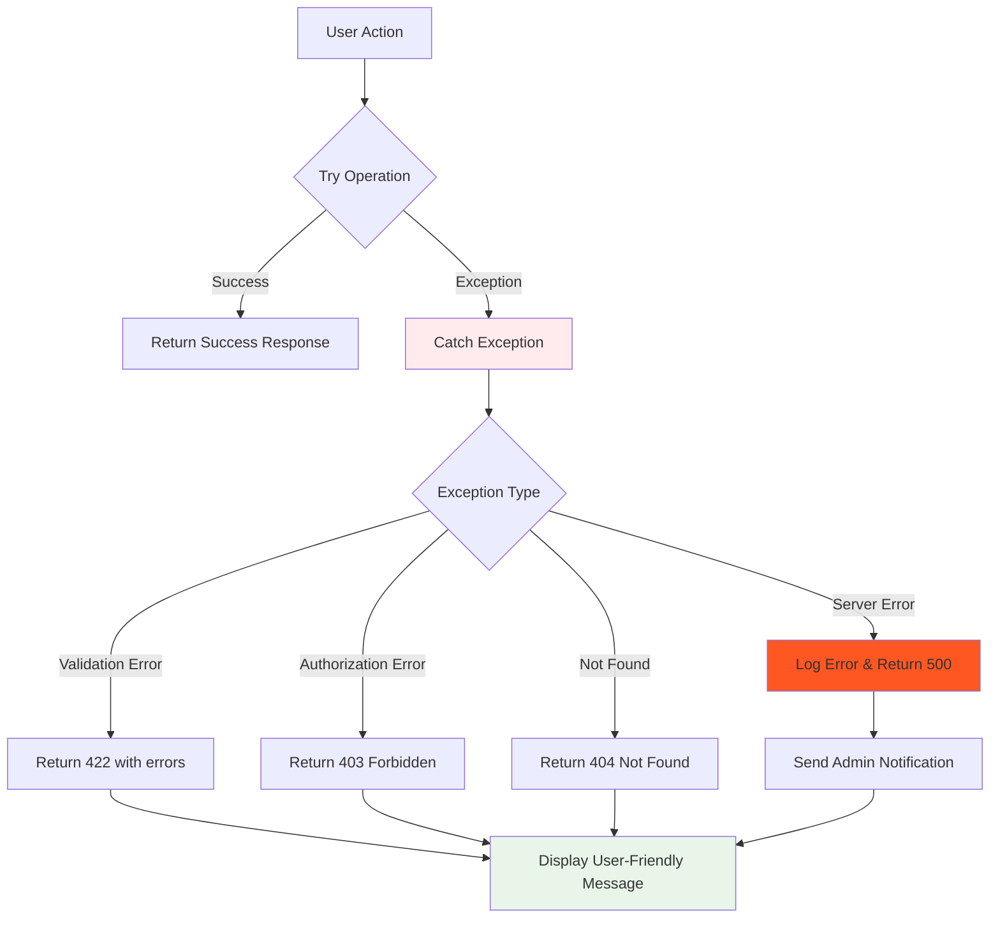

---

**🎉 Dokumentasi Schema Pemrograman Lengkap!**

> Dokumentasi ini mencakup seluruh arsitektur sistem, alur pemrograman, dan implementasi teknis dari Sistem Perpustakaan Digital SMK. Setiap komponen telah didesain dengan prinsip **clean code**, **security-first**, dan **scalability**.

---

**📞 Support & Maintenance**
- **Technical Documentation**: [DOCUMENTATION.md](DOCUMENTATION.md)
- **User Manual**: [USER_MANUAL.md](USER_MANUAL.md)
- **Database Schema**: [DATABASE_SCHEMA.md](DATABASE_SCHEMA.md)

**🔧 Development Team**: Full Stack Laravel Developer
**📅 Last Updated**: September 2025
**🏷️ Version**: 1.0.0

---