# 📊 System Flowcharts - Sistem Perpustakaan Digital SMK

[](https://mermaid.js.org)
[](https://diagrams.net)

> **Koleksi lengkap flowchart dan diagram alur untuk semua fitur sistem perpustakaan digital**

---

## 📋 **Table of Contents**

1. [System Overview](#-system-overview)
2. [User Authentication Flow](#-user-authentication-flow)
3. [Book Management Flow](#-book-management-flow)
4. [Loan Management Flow](#-loan-management-flow)
5. [Admin Management Flow](#-admin-management-flow)
6. [Email Notification Flow](#-email-notification-flow)
7. [Dashboard Analytics Flow](#-dashboard-analytics-flow)
8. [Error Handling Flow](#-error-handling-flow)
9. [Security Flow](#-security-flow)
10. [Database Transaction Flow](#-database-transaction-flow)

---

## 🌐 **System Overview**

### **High-Level System Architecture**

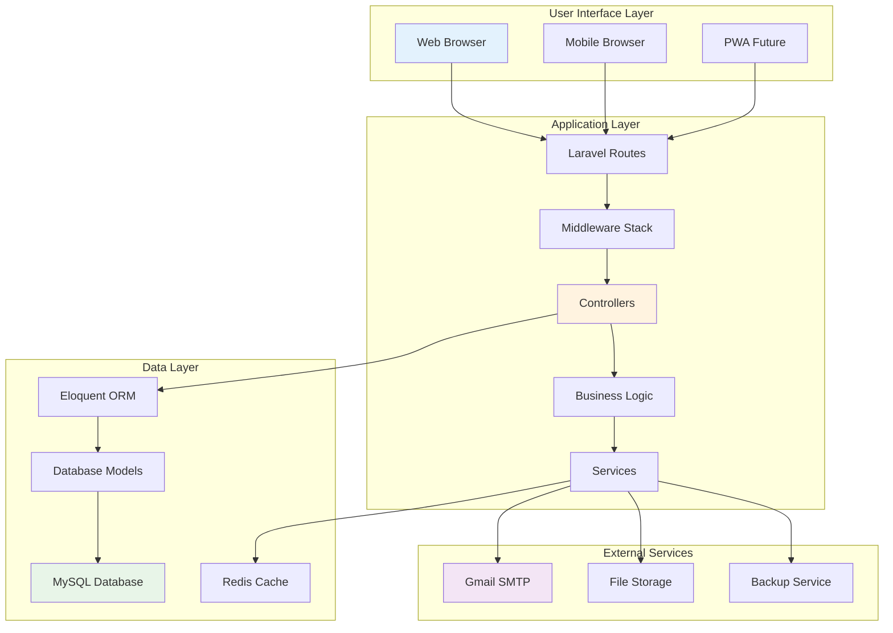

---

## 🔐 **User Authentication Flow**

### **Complete Registration Process**

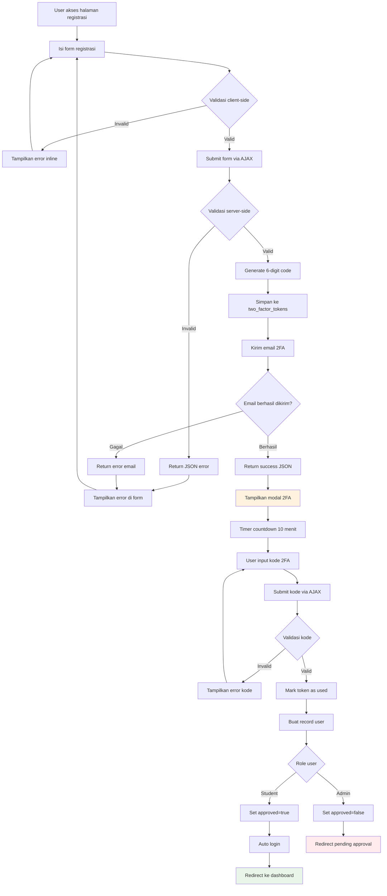

### **Login Process with 2FA**

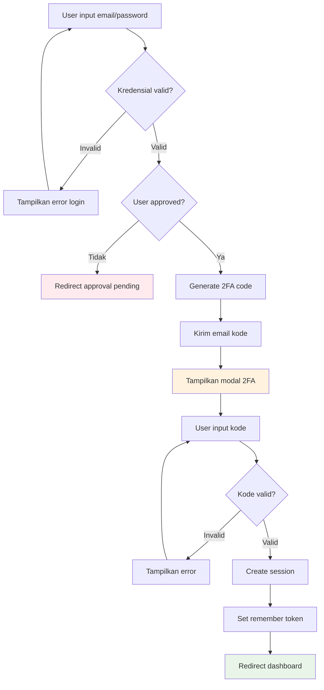

---

## 📚 **Book Management Flow**

### **Book CRUD Operations**

```mermaid
flowchart TD
    subgraph "Book Creation"
        A1[Admin klik 'Tambah Buku'] --> A2[Form tambah buku]
        A2 --> A3{Validasi input}
        A3 -->|Invalid| A4[Tampilkan error]
        A4 --> A2
        A3 -->|Valid| A5[Simpan ke database]
        A5 --> A6[Set available_quantity = quantity]
        A6 --> A7[Redirect dengan success]
    end

    subgraph "Book Update"
        B1[Admin klik 'Edit Buku'] --> B2[Form edit buku]
        B2 --> B3[Load data existing]
        B3 --> B4{Ada perubahan stok?}
        B4 -->|Ya| B5[Hitung selisih stok]
        B5 --> B6[Update available_quantity]
        B4 -->|Tidak| B7[Update data buku]
        B6 --> B7
        B7 --> B8[Redirect dengan success]
    end

    subgraph "Book Deletion"
        C1[Admin klik 'Hapus Buku'] --> C2{Ada loan aktif?}
        C2 -->|Ya| C3[Tampilkan error 'Buku sedang dipinjam']
        C2 -->|Tidak| C4[Konfirmasi penghapusan]
        C4 --> C5{User konfirmasi?}
        C5 -->|Tidak| C6[Batal hapus]
        C5 -->|Ya| C7[Soft delete buku]
        C7 --> C8[Redirect dengan success]
    end

    style A7 fill:#e8f5e8
    style B8 fill:#e8f5e8
    style C3 fill:#ffebee
    style C8 fill:#e8f5e8
```

### **Book Search & Filter System**

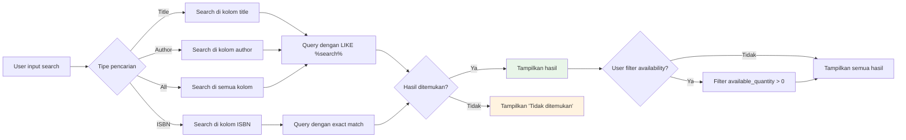

---

## 📋 **Loan Management Flow**

### **Book Borrowing Process**

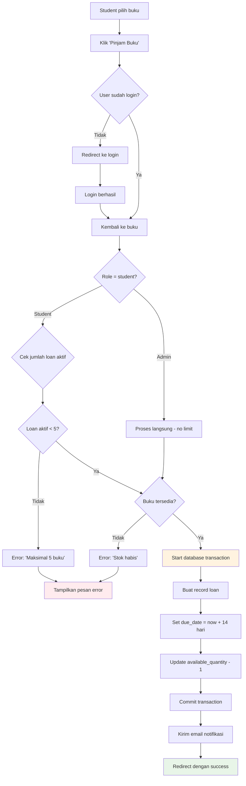

### **Book Return Process**

```mermaid
flowchart TD
    A[User klik 'Kembalikan Buku'] --> B{User authorized?}
    B -->|Tidak| C[Error 403 Forbidden]

    B -->|Ya| D{Buku sudah dikembalikan?}
    D -->|Ya| E[Error: 'Sudah dikembalikan']

    D -->|Tidak| F[Start database transaction]
    F --> G[Set returned_date = now()]
    G --> H[Update available_quantity + 1]
    H --> I[Commit transaction]
    I --> J{Telat dikembalikan?}
    J -->|Ya| K[Catat denda (future feature)]
    J -->|Tidak| L[Proses selesai]
    K --> L
    L --> M[Redirect dengan success]

    style M fill:#e8f5e8
    style C fill:#ffebee
    style E fill:#ffebee
```

### **Overdue Management System**

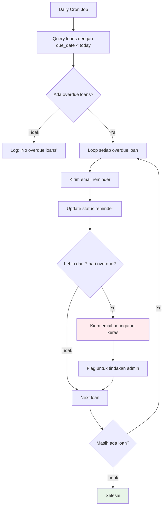

---

## 👨‍💼 **Admin Management Flow**

### **Admin Registration & Approval**

```mermaid
flowchart TD
    A[Calon admin registrasi] --> B[Pilih role 'Admin']
    B --> C[Proses 2FA sama seperti student]
    C --> D[Account created dengan approved=false]
    D --> E[Redirect ke approval pending page]

    E --> F[Super admin login]
    F --> G[Akses halaman user approval]
    G --> H[Review calon admin]
    H --> I{Keputusan super admin}

    I -->|Approve| J[Set approved=true]
    J --> K[Set approved_by = super admin ID]
    K --> L[Set approved_at = now()]
    L --> M[Kirim email approval]
    M --> N[Admin bisa login]

    I -->|Reject| O[Delete user record]
    O --> P[Kirim email rejection]
    P --> Q[Admin tidak bisa akses]

    style N fill:#e8f5e8
    style Q fill:#ffebee
    style E fill:#fff3e0
```

### **Admin Permission Matrix**

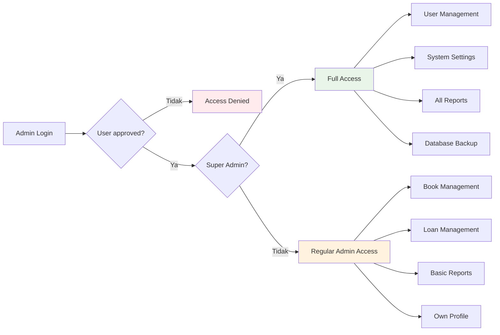

---

## 📧 **Email Notification Flow**

### **Email System Architecture**

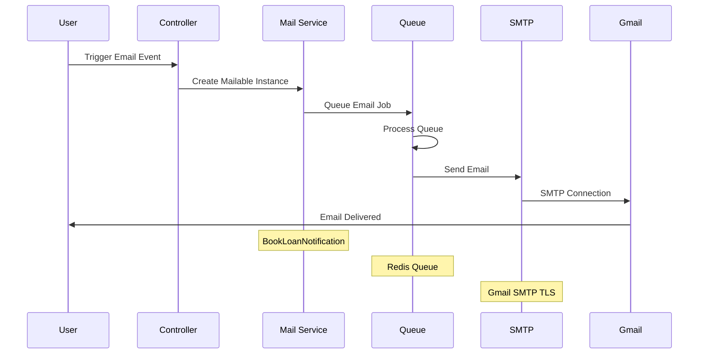

### **Email Template Selection**

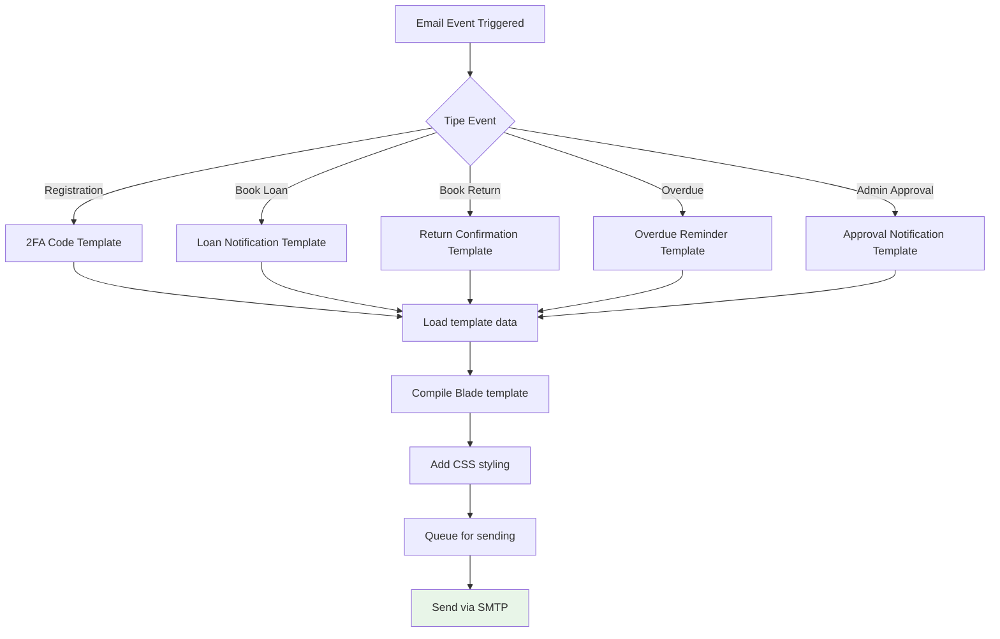

---

## 📊 **Dashboard Analytics Flow**

### **Real-time Dashboard Data Flow**

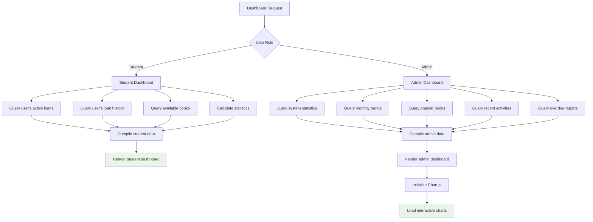

### **Chart Data Generation**

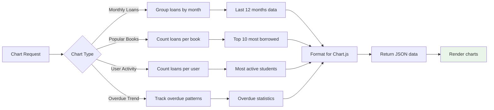

---

## ⚠️ **Error Handling Flow**

### **Global Exception Handling**

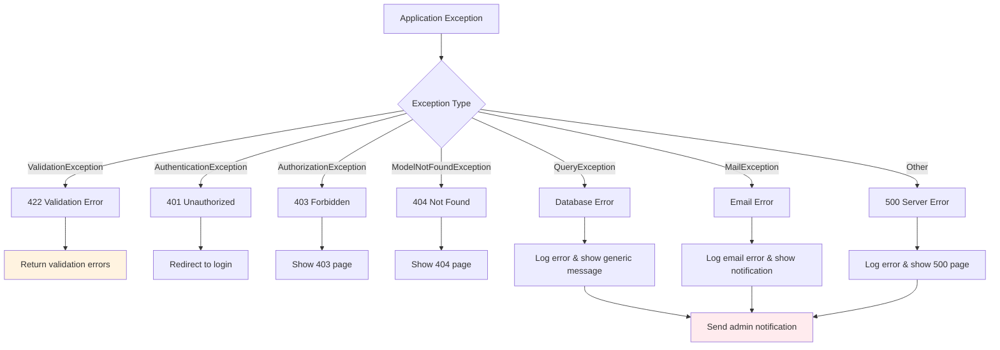

### **User-Friendly Error Messages**

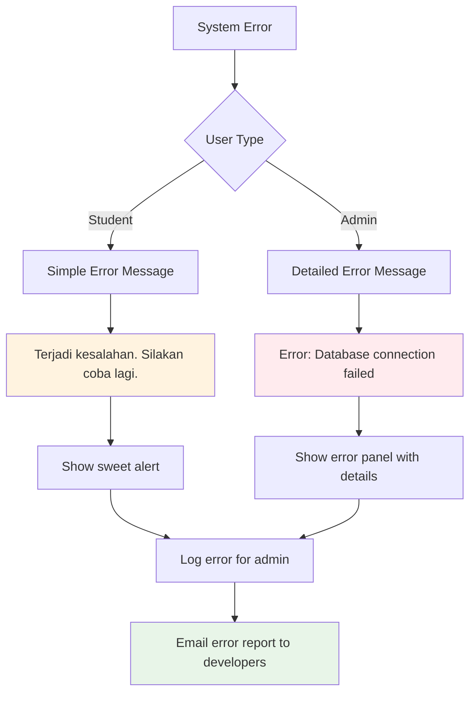

---

## 🛡️ **Security Flow**

### **Request Security Pipeline**

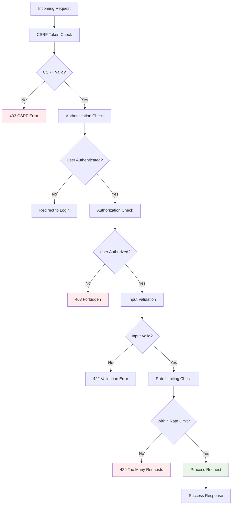

### **Data Sanitization Flow**

```mermaid
flowchart LR
    A[User Input] --> B[HTML Escape]
    B --> C[SQL Injection Prevention]
    C --> D[XSS Prevention]
    D --> E[Input Length Validation]
    E --> F[Type Validation]
    F --> G[Business Rule Validation]
    G --> H[Sanitized Data]

    H --> I[Database Storage]

    style H fill:#e8f5e8
    style I fill:#e8f5e8
```

---

## 🗄️ **Database Transaction Flow**

### **Book Borrowing Transaction**

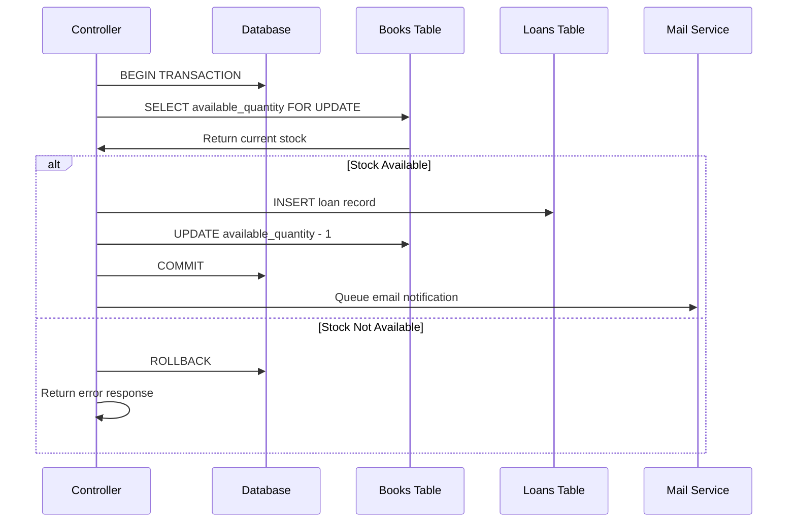

### **Database Integrity Checks**

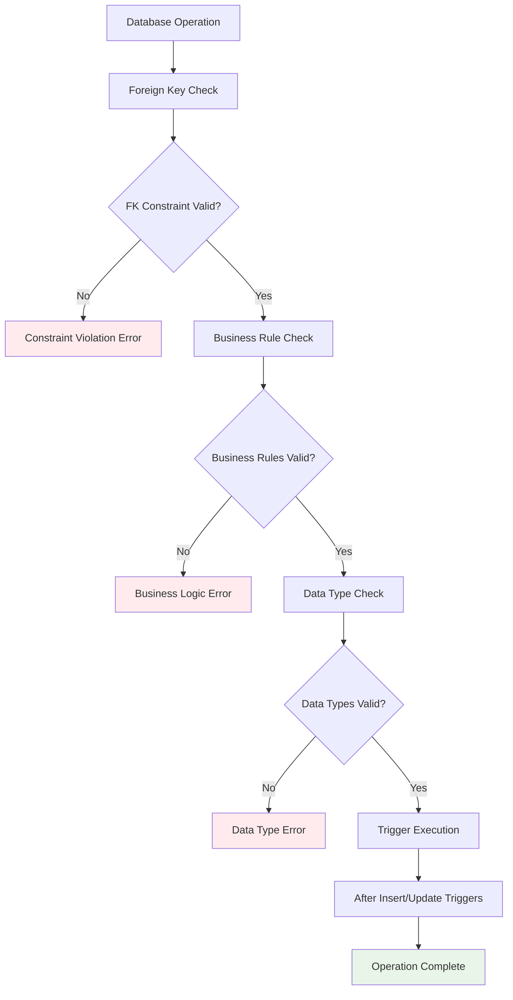

---

## 📱 **Responsive Design Flow**

### **Device Detection & Layout**

```mermaid
flowchart TD
    A[Page Load] --> B[Detect Device Type]
    B --> C{Device Type}

    C -->|Mobile| D[Mobile Layout]
    C -->|Tablet| E[Tablet Layout]
    C -->|Desktop| F[Desktop Layout]

    D --> G[Collapse Sidebar]
    D --> H[Stack Cards Vertically]
    D --> I[Touch-Friendly Buttons]

    E --> J[Sidebar Toggle]
    E --> K[2-Column Layout]
    E --> L[Medium Button Size]

    F --> M[Full Sidebar]
    F --> N[3-Column Layout]
    F --> O[Hover Effects]

    G --> P[Apply Styles]
    H --> P
    I --> P
    J --> P
    K --> P
    L --> P
    M --> P
    N --> P
    O --> P

    style P fill:#e8f5e8
```

---

## 🔄 **System Maintenance Flow**

### **Automated Maintenance Tasks**

```mermaid
flowchart TD
    A[Daily Cron Job] --> B[Cleanup Expired 2FA Tokens]
    B --> C[Archive Old Sessions]
    C --> D[Generate Daily Reports]
    D --> E[Check Overdue Books]
    E --> F[Send Reminder Emails]
    F --> G[Update Statistics Cache]
    G --> H[Database Optimization]
    H --> I[Backup Critical Data]
    I --> J[Send Health Report to Admin]

    style J fill:#e8f5e8
```

### **Manual Maintenance Tasks**

```mermaid
flowchart LR
    A[Admin Panel] --> B{Maintenance Task}

    B -->|User Management| C[Approve/Reject Users]
    B -->|Data Cleanup| D[Archive Old Data]
    B -->|Reports| E[Generate Custom Reports]
    B -->|System Health| F[Check System Status]

    C --> G[Update User Status]
    D --> H[Move to Archive Tables]
    E --> I[Export to Excel/PDF]
    F --> J[Display Health Metrics]

    style G fill:#e8f5e8
    style H fill:#fff3e0
    style I fill:#e8f5e8
    style J fill:#e8f5e8
```

---

## 🎯 **Performance Optimization Flow**

### **Query Optimization Strategy**

```mermaid
flowchart TD
    A[Database Query] --> B[Check Query Cache]
    B --> C{Cache Hit?}
    C -->|Yes| D[Return Cached Result]

    C -->|No| E[Execute Query]
    E --> F[Eager Load Relationships]
    F --> G[Apply Indexes]
    G --> H[Optimize WHERE Clauses]
    H --> I[Limit Result Set]
    I --> J[Cache Result]
    J --> K[Return Data]

    style D fill:#e8f5e8
    style K fill:#e8f5e8
```

---

**🎉 Flowchart System Lengkap!**

> Dokumentasi ini mencakup semua alur sistem dalam bentuk flowchart yang mudah dipahami dan diimplementasikan. Setiap diagram menggambarkan proses bisnis dan teknis yang detail dari Sistem Perpustakaan Digital SMK.

---

**📞 Quick Reference**
- **Main Documentation**: [DOCUMENTATION.md](DOCUMENTATION.md)
- **Programming Schema**: [PROGRAMMING_SCHEMA.md](PROGRAMMING_SCHEMA.md)
- **Database Schema**: [DATABASE_SCHEMA.md](DATABASE_SCHEMA.md)
- **User Manual**: [USER_MANUAL.md](USER_MANUAL.md)

**🔧 Development Team**: Full Stack Laravel Developer
**📅 Last Updated**: September 2025
**🏷️ Version**: 1.0.0

---